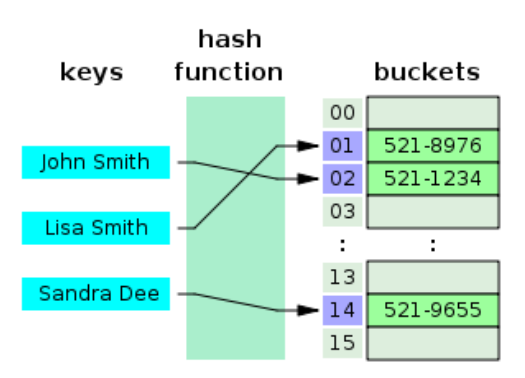

# Algoritme - HeapAndHeapSort

## Hva er en heap?

Innenfor informatikken er haugsortering en sammenligningsbasert sorteringsalgoritme. Haugsortering er en forbedret versjon av utvelgelsesortering, og på samme måte som denne algoritmen deler den innmatningen i en sortert og en usortert region, og reduserer størrelsen på den usorterte regionen iterativt ved å dra ut de største elementene og flytte dem inn i den sorterte region. Forbedringen består av bruken av datastrukturen haug i stedet for en søken etter å finne det maksimale over lineær tid

## Metoder:
### Obligatoriske:
- loadFactor
- antData
- hash
- insert
- search
- remove?

## Bilder:
