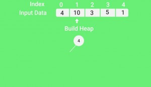
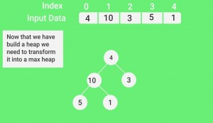
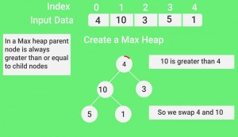
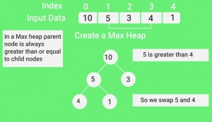
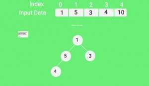
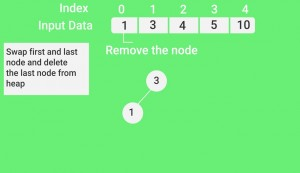

# Algoritme - HeapAndHeapSort

## Hva er en heap?

Innenfor informatikken er haugsortering en sammenligningsbasert sorteringsalgoritme. Haugsortering er en forbedret versjon av utvelgelsesortering, og på samme måte som denne algoritmen deler den innmatningen i en sortert og en usortert region, og reduserer størrelsen på den usorterte regionen iterativt ved å dra ut de største elementene og flytte dem inn i den sorterte region. Forbedringen består av bruken av datastrukturen haug i stedet for en søken etter å finne det maksimale over lineær tid

## Metoder:
### Obligatoriske:
- isEmpty
- insert
- removeMin
- print

## Bilder:

# HeapSort
## Metoder:
### Obligatoriske:
- sort
- siftUp
    - A[0] - A[i-1] is a maxheap
    - Inserts A[i] correctly into heap by swapping it upwards
- siftDown
    - A[0] - A[i] is a maxheap, maybe except for root at A[0]
    - Restores heap by swapping root downwards
