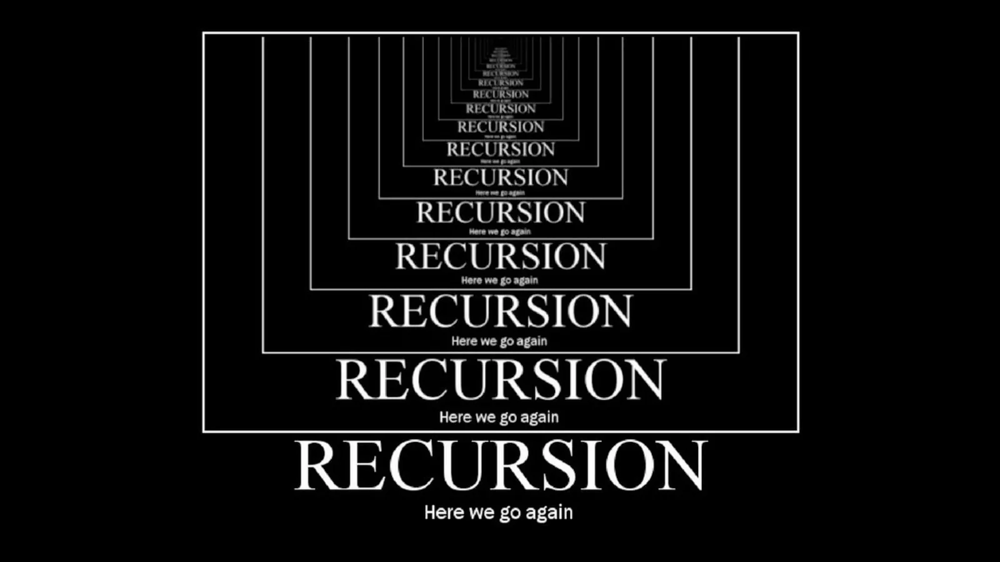

# Algoritme - Recursion

## Hva er en Rekursiv programmering?

I informatikk er rekursjon en metode for å løse et problem der løsningen avhenger av løsninger på mindre forekomster av samme problem. Slike problemer kan generelt løses ved iterasjon, men dette må identifisere og indeksere de mindre forekomstene på programmeringstidspunktet.

## Metoder:
- kaller seg selv.

## Bilder:

