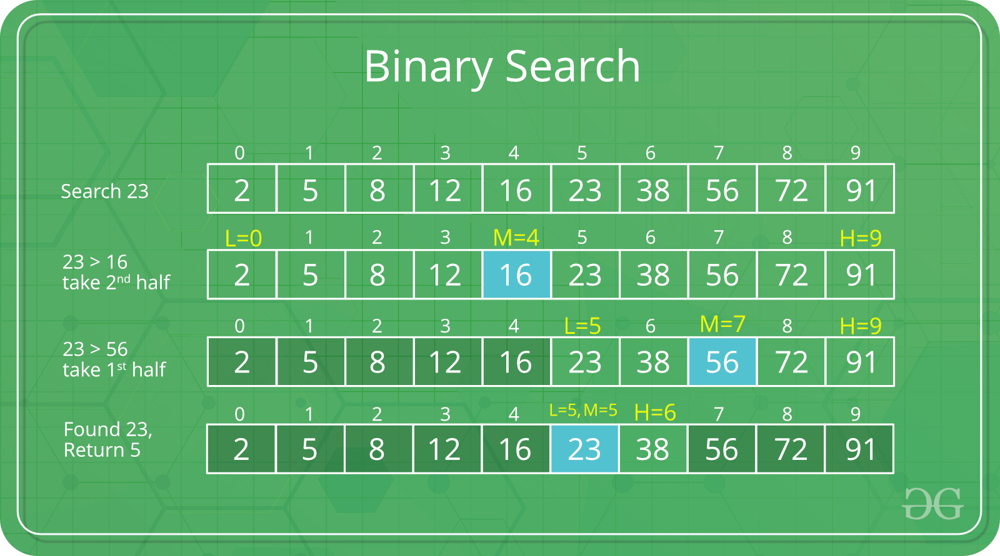

# Algoritme - Search

## Hva er en søkealgoritme?

En søkealgoritme er en metode for å finne en ønsket verdi i en liste. 
Den sjekker hvert element i lista om verdien er ønsker verdi, helt til den har funent den,
eller til det ikke er flere elementer i lista.

Lineærsøk er sjeldent praktisk, fordi andre algoritmer som
binærsøk eller hashtabeller gjør dette mye raskere for alle utenom små lister

## Metoder:
- binarySearch
- sequentialSearch
- interpolationSearch

## Bilder:

