## Oppgave 1

1. Et B-tre av orden 3 kalles et "2-3 tre". Hver node kan her ha enten 1 eller 2 verdier og maksimalt 3 barn. Tegn en figur som viser hvordan et B-tre av orden 3, som initielt er tomt, ser ut etter at disse verdiene er satt inn i treet i rekkefølge:

       44 55 13 97 75 42 11 22 27

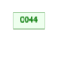

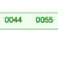

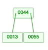

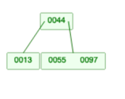

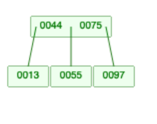

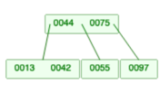

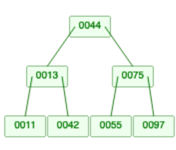

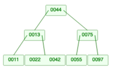

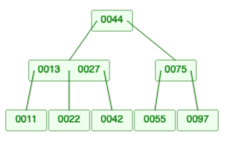

2. Et B-tre av orden 4 kalles et "2-3-4 tre" eller bare et "2-4 tre". I et slikt tre kan nodene ha 1, 2 eller 3 verdier, og maksimalt 4 barn. Tegn en figur som viser hvordan et B-tre av orden 4, som initielt er tomt, ser ut etter innsetting av de samme verdiene som i oppgave a.

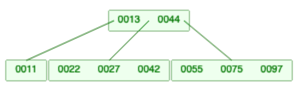

3. Tegn en figur som viser hvordan et B-tre av orden 4, som initielt er tomt, ser ut etter at disse verdiene er satt inn i treet i rekkefølge:

       44 55 13 97 75 42 11 22 27 43 65 33 77 25 49 21 29 57

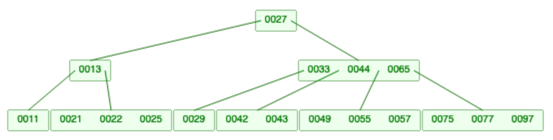

4. Tegn det tilsvarende B+-treet for de to trærne fra oppgave b og c.

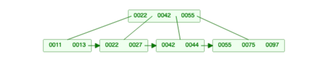

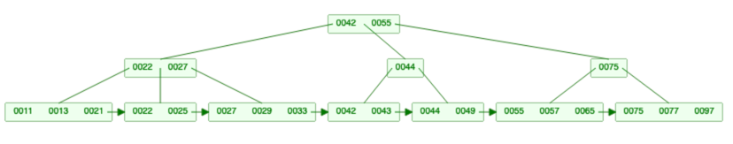