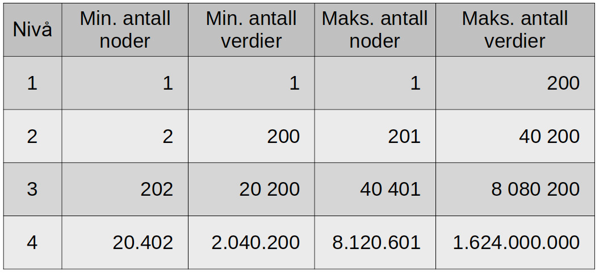

# 11.2: Øvingsoppgaver

#### Oppgaver:
- [x] Oppgave 1
  - [x] Oppgave a
  - [x] Oppgave b
  - [x] Oppgave c
  - [x] Oppgave d
- [x] Oppgave 2
- [x] Oppgave 3
- [x] Oppgave 4
  - [x] Oppgave a
  - [x] Oppgave b
  - [x] Oppgave c - VANSKELIG!
## Oppgave 1

1. Et B-tre av orden 3 kalles et "2-3 tre". Hver node kan her ha enten 1 eller 2 verdier og maksimalt 3 barn. Tegn en figur som viser hvordan et B-tre av orden 3, som initielt er tomt, ser ut etter at disse verdiene er satt inn i treet i rekkefølge:

       44 55 13 97 75 42 11 22 27

2. Et B-tre av orden 4 kalles et "2-3-4 tre" eller bare et "2-4 tre". I et slikt tre kan nodene ha 1, 2 eller 3 verdier, og maksimalt 4 barn. Tegn en figur som viser hvordan et B-tre av orden 4, som initielt er tomt, ser ut etter innsetting av de samme verdiene som i oppgave a.

3. Tegn en figur som viser hvordan et B-tre av orden 4, som initielt er tomt, ser ut etter at disse verdiene er satt inn i treet i rekkefølge:

       44 55 13 97 75 42 11 22 27 43 65 33 77 25 49 21 29 57

4. Tegn det tilsvarende B+-treet for de to trærne fra oppgave b og c.

## Oppgave 2

Et binært søketre kan betraktes som et n-ært søketre av orden 2, der hver node har maksimalt 2 barn og inneholder bare 1 nøkkelverdi. Hvorfor finnes det ikke B-trær med orden lik 2? Eller sagt på en annen måte: Hvorfor kan ikke et binært søketre også være et B-tre?

## Oppgave 3

På forelesning gikk vi gjennom følgende tabell som viser det minimale og maksimale antall noder og nøkkelverdier på hvert nivå i treet, for de fire øverste nivåene i et B-tre med orden lik 201:

## Oppgave 4

Oppgave 3 fra eksamen i [Algoritmer og Datastrukturer](https://it.hiof.no/algdat/oppgaver/algdat_eksamen_16-05-2013.pdf) fra 2013