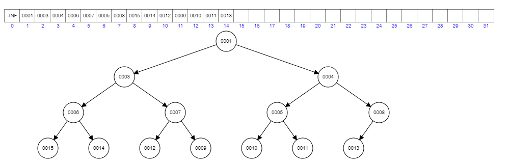
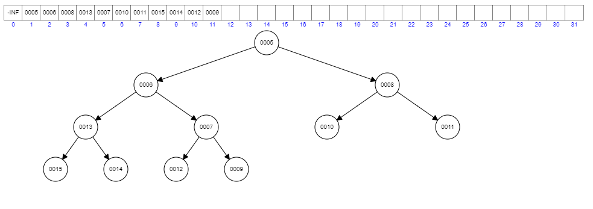

## Oppgave 1

a. Tegn heap'en som du får ved å sette inn disse verdiene i rekkefølge, i en min-heap som initielt er tom:

     10, 12, 1, 14, 6, 5, 8, 15, 3, 9, 7, 4, 11, 13

b. Tegn heap'en fra oppgave a., etter at minste element er tatt ut tre ganger.

a. 

b.
