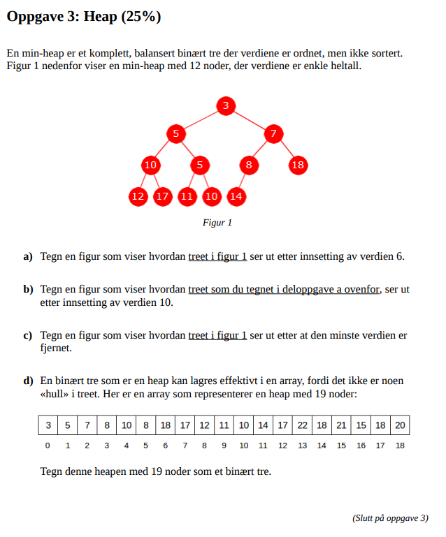
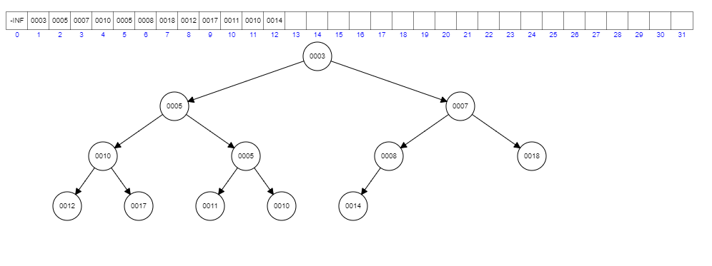
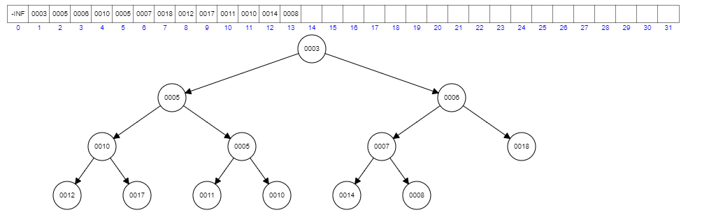
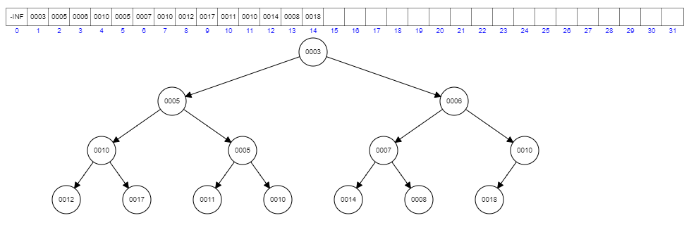
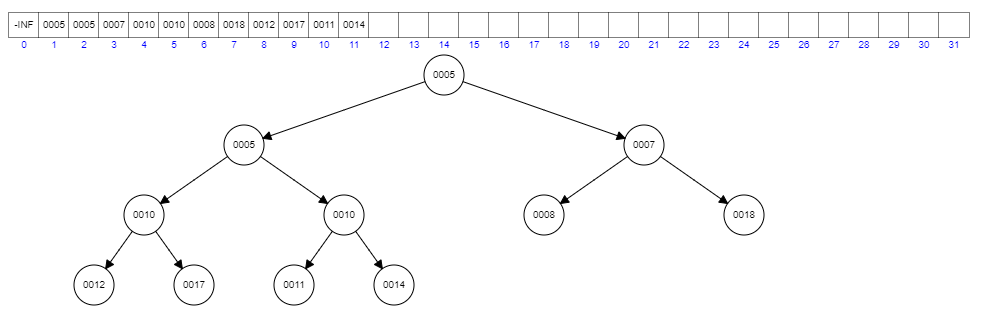
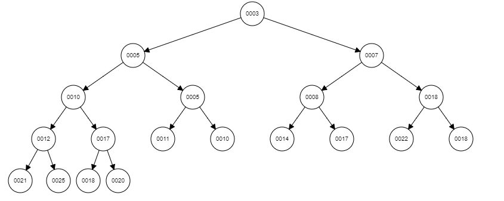
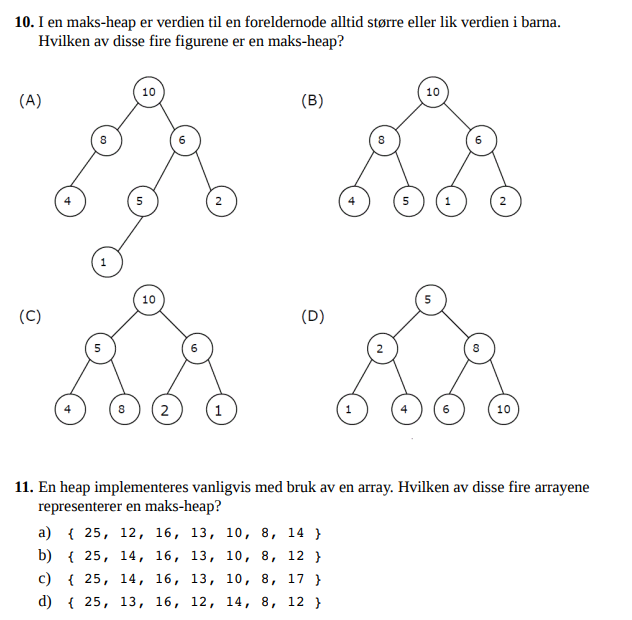

## Oppgave 2
1. Oppgave 3 fra ny/utsatt [eksamen i januar 2018](https://it.hiof.no/algdat/oppgaver/eksamen_05-01-2018/eksamen_05-01-2018.pdf)

a.
før innsetting av verdi 6

etter innsetting

b.
etter innsetting av verdien 10

c.
tre fra oppgaveteksten, etter fjerning av minste verdi:

d. Heapen som binært tre.

2. Oppgavene 1.10 og 1.11 fra (eksamen i mai 2018)[https://it.hiof.no/algdat/oppgaver/eksamen_28-05-2018/eksamen_28-05-2018.pdf]

1.10: b
1.11: b