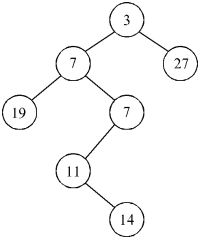

## Oppgave 1

a. Tegn heap'en som du får ved å sette inn disse verdiene i rekkefølge, i en min-heap som initielt er tom:

     10, 12, 1, 14, 6, 5, 8, 15, 3, 9, 7, 4, 11, 13

b. Tegn heap'en fra oppgave a., etter at minste element er tatt ut tre ganger.

## Oppgave 2
1. Oppgave 3 fra ny/utsatt eksamen i januar 2018 (Lenker til en ekstern side.)
2. Oppgavene 1.10 og 1.11 fra eksamen i mai 2018 (Lenker til en ekstern side.)

## Oppgave 3
Dette er en tidligere eksamensoppgave, som dreier seg om "heap-ordnede" binære trær der dataene i hver node er et heltall. Nodene i treet er definert slik:

    class node{
        node() ...  // Konstruktør
        int verdi;  // Heltallsverdi
        node v, h;  // Venstre og høyre barn
    }

Du kan anta at du har tilgang til variablene i node-klassen fra programkoden som skal skrives, f.eks. med "friendly access".

Vi skal betrakte trær som er "heap-ordnede", d.v.s. at enhver node har en verdi som er mindre eller lik verdien i dens eventuelle barn. Trærne behøver derimot ikke oppfylle de øvrige kravene til en heap, f.eks. behøver de ikke være balanserte. Et eksempel på et slikt heap-ordnet tre er dette:

1. Skriv en metode:

    void reparer(node rot)

Denne metoden har som parameter en referanse til roten i et tre der begge subtrærne til roten er heap-ordnede (hvis de ikke er tomme), mens verdien i selve roten kan være slik at den bryter mot heap-ordningen.
Metoden skal bytte om på verdiene i treet slik at hele treet blir heap-ordnet. Den skal ikke være rekursiv og skal helst være så effektiv som mulig. Merk at metoden altså ikke skal forandre på noen av referansene i treet, men bare bytte rundt på verdier som står i nodene.

2. Skriv en metode:

    void lag_heap_ordning(node rot)

Metoden har som parameter en referanse til roten i et tre der nodene har helt vilkårlige verdier, uten noen innbyrdes ordning. Metoden skal bytte rundt på disse verdiene slik at treet blir et heap-ordnet tre med de samme verdiene. Den skal være rekursiv og skal benytte metoden reparer fra oppgave a).

3. Hvilken orden (angitt med O-notasjon) har tidsforbruket til metoden lag_heap_ordning fra forrige oppgave dersom treet inneholder n noder og
Treet er komplett, d.v.s. at alle nivåer, muligens bortsett fra det dypeste nivået, er helt fylt opp med noder?
Hver node (bortsett fra én) har nøyaktig ett subtre (som ikke er tomt), og den siste noden har ingen ikke-tomme subtrær?

4. Skriv en metode:

     int tell(node rot, int verdi)

som returnerer antall ganger heltallsverdien verdi forekommer i et heap-ordnet tre som beskrevet ovenfor. Parameteren rot er en referanse til roten i treet. Du kan selv velge om metoden skal være rekursiv eller iterativ. Legg vekt på å lage metoden så effektiv som mulig.