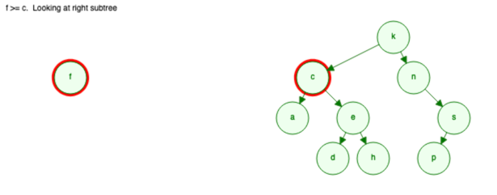
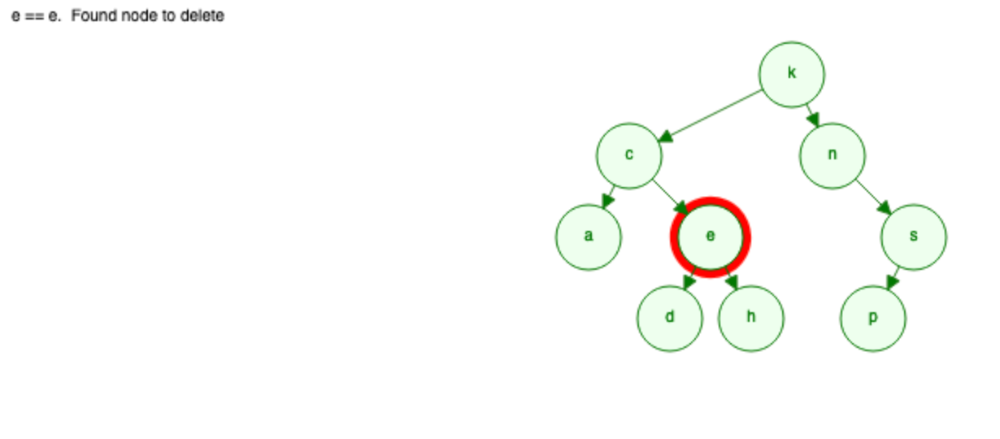

# 9.3: Øvingsoppgaver
## Oppgave 1
Denne oppgaven baserer seg på følgende binære søketre (ikke AVL) der verdien i hver node er en enkel bokstav:

           k
          / \
         /   \
        c     n
       / \     \
      a   e     s
         / \   / 
        d   h p

1. Sett inn hver av disse verdiene i dette treet:

       m  f  b  t  c  s

Finn ut hvilke sammenligninger av verdier som blir gjort i hver enkelt av tilfellene. Gjør hver innsetting uavhenging av de andre, slik at innsettingen foregår i det opprinnelige treet som er "tegnet" ovenfor:

2. Finn hvilke sammenligninger som blir gjort når vi leter etter følgende verdier i søketreet ovenfor:

       c  s  k  a  d  f  t

3. Bruk den vanlige algoritmen for fjerning av node fra et søketre til å fjerne følgende verdier fra treet ovenfor:

       a  p  n  s  e  k

Gjør hver fjerning uavhengig av de andre, slik at fjerningen hele tiden skjer i det opprinnelige treet. Kontroller at fjerningen gjøres riktig, dvs. at treet fortsatt er et søketre etter at en verdi er fjernet.

### SVAR:

#### Oppgave 1a

Opprinnelig: 

m:

f:

b:

t:

c:

s:

### Oppgave 1b

           k
          / \
         /   \
        c     n
       / \     \
      a   e     s
         / \   / 
        d   h p

c  s  k  a  d  f  t

c: 
- c < k -> venstre 
- c = c -> funnet, høyde = 1

s: 
- s > k -> høyre 
- s > n -> høyre 
- s = s -> funnet, høyde = 2

k: 
- k = k -> funnet, høyde = 0

a:
- a < k -> venstre 
- a < c -> venstre 
- a = a -> funnet, høyde = 2

d:
- d < k -> venstre 
- d > c -> høyre 
- d < e -> venstre 
- d = d -> funnet, høyde = 3

f:
- f < k -> venstre 
- f > c -> høyre 
- f > e -> høyre 
- f < h -> venstre 
- f < null -> ikke funnet, høyde (elementet med null) = 4

t: 
- t > l -> høyre 
- t > n -> høyre
- t > s -> høyre 
- t < null -> ikke funnet, høyde (element med null) = 3

### Oppgave 1c
    a  p  n  s  e  k

Deleting:

a: 

p:

           k
          / \
         /   \
        c     n
       / \     \
      a   e     s
         / \   / 
        d   h p

n:
- n > k -> høyre, forelder = null
- n = n -> forelder = k, 
  - setter barn til n lik k -> k.right = s

s:
- s > k -> høyre, forelder = null
- s > n -> høyre, forelder = k
- s = s -> forelder = n, 
  - setter n.right = p
  
e:

1. e>k -> høyre
2. e<c -> venstre
3. e=e -> 2 barn -> gå til venstre og finn største node i venstre subtre

k:

