### Oppgave 3
#### a)
Ta utgangspunkt i følgende AVL-tre med verdiene 1,2,3,...,10:
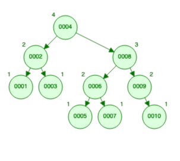

Steg for steg etter insetting innsetting (i denne rekkefølgen) av verdiene 11,12,13,...,20. 

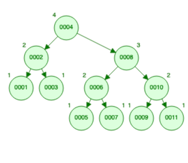
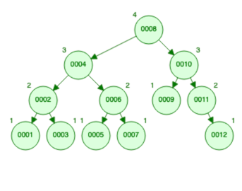
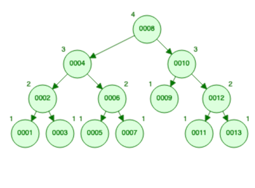
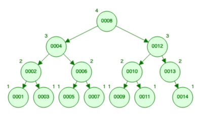
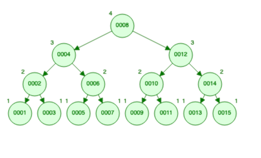
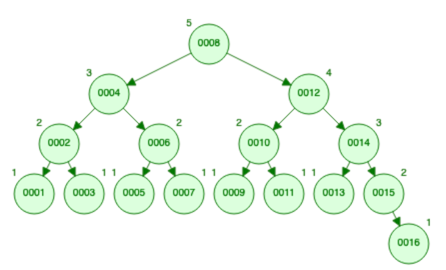
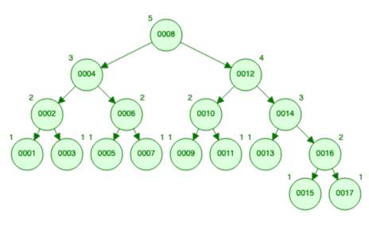
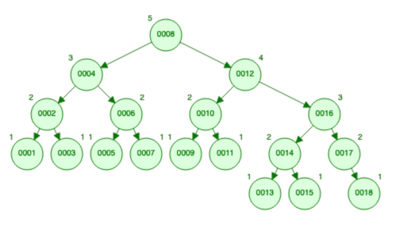
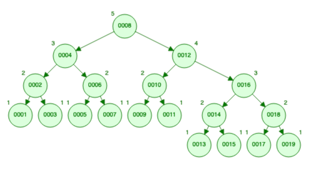
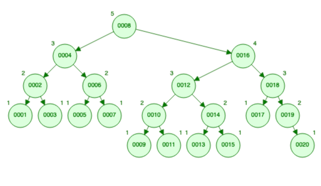

#### b)
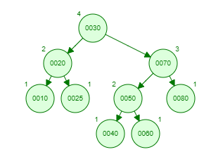

Ved å legge till tallene

    45, 55, 65, 75 

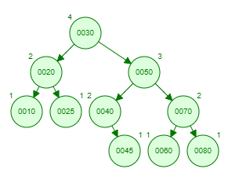
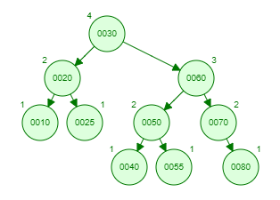
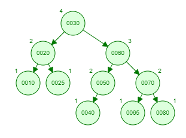

#### c)

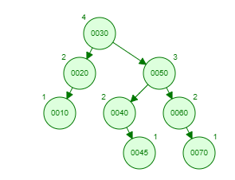

1. 75 og deretter 80

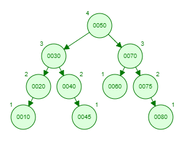

2. 75 og deretter 65

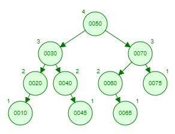

3. 75, 35 og 47 

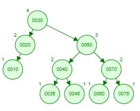
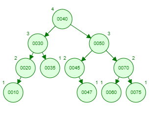

4. 75, 35 og 32

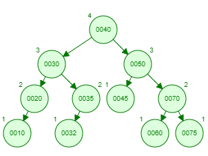