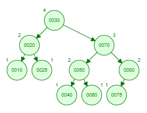
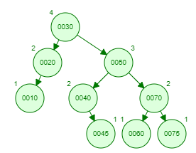

### Oppgave 3
#### a)
Ta utgangspunkt i følgende AVL-tre med verdiene 1,2,3,...,10:

Steg for steg etter insetting innsetting (i denne rekkefølgen) av verdiene 11,12,13,...,20. 

#### b)

Ved å legge till tallene

    45, 55, 65, 75 

#### c)

1. 75 og deretter 80

2. 75 og deretter 65

3. 75, 35 og 47 

4. 75, 35 og 32

