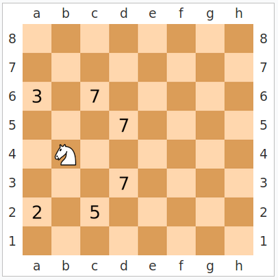

# Obligatorisk oppgave 2: Springerproblemet

Et klassisk problem som er beslektet med dronningproblemet, og som angivelig ble løst av den tyske matematikeren [Gauss](http://en.wikipedia.org/wiki/Carl_Friedrich_Gauss) da han var 4 år, er det såkalte springerproblemet.

En springer (eller hest) er en sjakkbrikke som kan gå to skritt frem (i vilkårlig retning) og ett til siden. Figuren nedenfor viser de lovlige posisjonene som en springer kan flyttes til.

Springerproblemet består av å finne en måte å bevege en springer rundt på et sjakkbrett, fra en gitt utgangsposisjon, slik at den er innom alle ruter på brettet en og bare en gang. Her er en animasjon av en løsning på problemet:

Det skal lages et Java-program som løser springerproblemet for et n X n sjakkbrett. Størrelsen på sjakkbrettet, n, og springerens startposisjon skal oppgis av bruker. Det er tilstrekkelig at programmet finner kun én løsning av problemet. Løsningen skal skrives ut som en sekvens av sjakktrekk/springerflytt, f.eks. på denne måten for et 5x5 brett:

    1 10  5 18  3
    14 19  2 11  6
    9 22 13  4 17
    20 15 24  7 12
    23  8 21 16 25

Det vil ikke alltid finnes en løsning på springerproblemet, dette avhenger av brettstørrelse og utgangsposisjon. I så fall skal programmet skrive ut at det ikke fant noen løsning.

Oppgaven kan løses ved først å lage en rekursiv funksjon som genererer alle mulige "springerturer" med lengde n X n (også utenfor brettet). Man kan så legge inn avskjæring slik at springeren holder seg innenfor brettet og aldri oppsøker en rute to ganger.

Dere anbefales å lage en løsning som tar utgangspunkt i programmet for å finne veien i en labyrint (Lenker til en ekstern side.). Det er her lagt inn en del kommentarer i koden, som gir hint om hva som må endres for at programmet skal kunne skrives om til i stedet å løse springerproblemet.

Merk at en slik "standardløsning" som prøver alle 8 mulige veier videre fra hvert felt, vil få en enormt stor arbeidsmengde. For f.eks. et 8x8 brett finnes det mer enn 1051 mulige trekksekvenser. Programmet vil som oftest "aldri bli ferdig" for n > 7.

Begynn derfor med små verdier av n når programmet skal testes. Dere kan f.eks. prøve disse tre tilfellene, der en løsning på springerproblemet skal kunne finnes raskt:

n     | 5      | 6     | 7
------|--------|-------| ---
start | *(1,1) | (1,1) | (2,2) 

Det finnes flere raskere måter å løse springerproblemet på. En kjent heuristisk effektivisering er den såkalte Warnsdorf's regel:

- Prøv bare én vei videre fra hvert felt. 
- Springeren flyttes alltid videre til det feltet som har færrest mulige trekk videre. 

I figuren nedenfor vil man velge å flytte til feltet merket med "2" ved bruk av denne regelen.

Warnsdorf-strategien finner oftest en løsning mye raskere, og fungerer også for større verdier av n. Dere kan gjerne implementere denne effektiviseringen, men det er ikke et krav for å få godkjent løsningen.

*: (1,1) betegner her feltet øverst til venstre på brettet. 