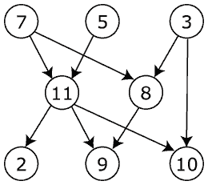

# Obligatorisk oppgave 6: Topologisk sortering

I denne oppgaven skal det lages et Java-program som implementerer en klassisk grafalgoritme som heter topologisk sortering.

## Bakgrunn
Topologisk sortering brukes bare på grafer som er rettede og som ikke inneholder cykler (ellers virker ikke algoritmen). Et eksempel på en slik graf er denne:

En topologisk sortering av grafen er en ordning/rekkefølge av nodene slik at:

    Dersom det finnes en vei i grafen fra node a til node b, så kommer b etter a i sorteringen. 

En annen måte å beskrive en topologisk sortering på er:

    Ingen node i grafen kan sorteres foran en en annen node som "peker" på den. 

Det vil oftest finnes flere lovlige topologiske sorteringer av en graf. For f.eks. figuren ovenfor, er hver av disse tre ordningene en topologisk sortering av grafen:

    7, 5, 3, 11, 8, 2, 9, 10
    7, 5, 11, 2, 3, 10, 8, 9
    3, 7, 8, 5, 11, 10, 9, 2 

Topologisk sortering brukes typisk for prosesser eller prosjekter som består av deloppgaver som avhenger av hverandre. Hver node i grafen beskriver da en slik deloppgave, og kantene angir hvilke oppgaver som må gjøres før andre oppgaver. En topologisk sortering vil gi en rekkefølge for utførelsen av deloppgavene, som gjør at ingen oppgaver vil starte før alle deloppgavene den avhenger av er ferdige.

Et eksempel på dette er grafen nedenfor, der hver node inneholder en emnekode for et kurs/emne som tilbys i et studium (emnekodene er hentet fra informatikkstudiet ved Universitetet i Oslo). Kantene/pilene angir at ett bestemt kurs må være fullført før man kan ta neste kurs.

F.eks. ser vi fra grafen at emnet INF110 (som har tre inngående kanter) krever at man har fullført emnene MA100, INF101 og INF111. Emnet IN210 krever bl.a. MA-IN118, som igjen krever fullført MA008.

En lovlig topologisk sortering (det finnes flere) av denne grafen er:

    MA100, INF101, MA008, INF11, INF103, MA-IN118, INF102, INF110, INF212, IN211, IN210, INF310, IN395 

For en grundig innføring i topologisk sortering, se f.eks. denne videoforelesningen på YouTube:

    Topological Sort (Lenker til en ekstern side.)

## Algoritme
Et viktig begrep som brukes i algoritmen for topologisk sortering er inngraden til nodene i grafen:

    Inngraden til en node i en rettet graf er antall kanter inn til noden, 

For f.eks. emnegrafen ovenfor, er inngraden til noden INF110 lik 3, inngraden til IN395 er 1, og inngraden til MA100 er lik 0. Det betyr at en topologisk sortering f.eks. kan starte med noden MA100, siden den ikke har noen forgjengere.

Det finnes flere algoritmer som kan brukes for å finne topologiske sorteringer. I denne oppgaven skal dere bruke følgende algoritme, som alltid starter med en node som har inngrad lik 0, for å skrive ut en topologisk sortering:

        Gå gjennom hele grafen, beregn og ta vare på inngraden til alle noder.

        Legg alle noder med inngrad lik 0 i en mengde S.

        Så lenge det finnes noder igjen i S:

            Ta ut en node a fra mengden S
            Skriv ut noden a
            For hver av noden a sine naboer:

                Reduser inngraden til naboen med 1
                Hvis denne naboen nå har fått inngrad lik 0, legg den til i mengden S  

Når algoritmen er ferdig, er hele den topologiske sorteringen skrevet ut.

For å lagre inngradene til hver node kan man bruke en ekstra array. Mengden S med noder som har inngrad 0, kan f.eks. lagres i en kø (stack eller liste vil også fungere fint). Merk at algoritmen vil feile hvis det er cykler i grafen.

## Krav til implementasjonen
Det skal programmeres en fungerende versjon av topologisk sortering av rettede grafer.

Programmet skal implementere en klasse topSort. Denne klassen skal være en utvidelse av klassen enkelGraf (Lenker til en ekstern side.), som brukes i dette kurset for å implementere uvektede grafer (der dataene bare er en enkel tekststreng) med en nabomatrise:

    public class topSort extends enkelGraf; 

Her kan dere gjerne ta utgangspunkt i klassen traverserGraf (Lenker til en ekstern side.), som implementerer DFS og BFS ved å utvide enkelGraf.

Klassen topSort skal inneholde metoden:

    public void findAndPrint(); 

Denne metoden skal finne og skrive ut én topologisk sortering av grafen som leses inn fra fil ved opprettelse av et nytt topSort-objekt. For hver node skal dataene (tekststrengen) i noden skrives ut.

Dere kan bruke de to rettede grafene vist i figurene ovenfor til å teste programmet deres. Datafiler for grafene finner dere her:

[graf_topsort_1.txt](https://it.hiof.no/algdat/kode/graf_topsort_1.txt)

[graf_topsort_2.txt](https://it.hiof.no/algdat/kode/graf_topsort_2.txt)